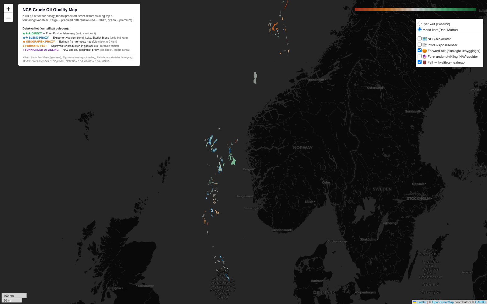
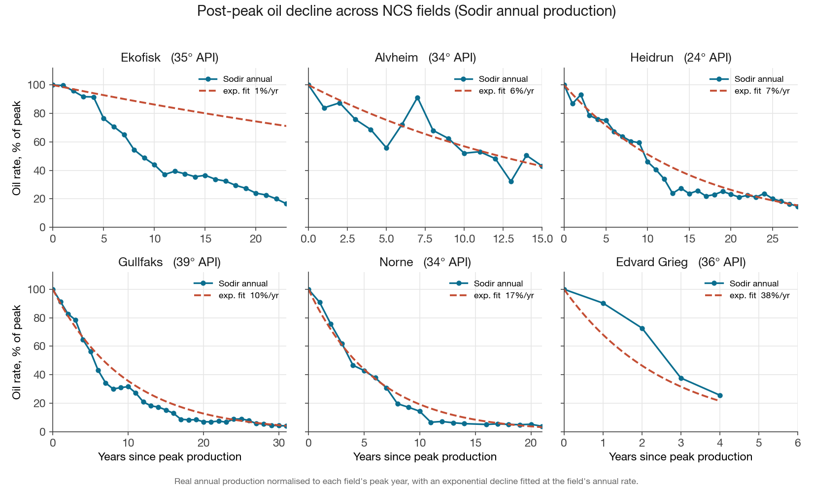
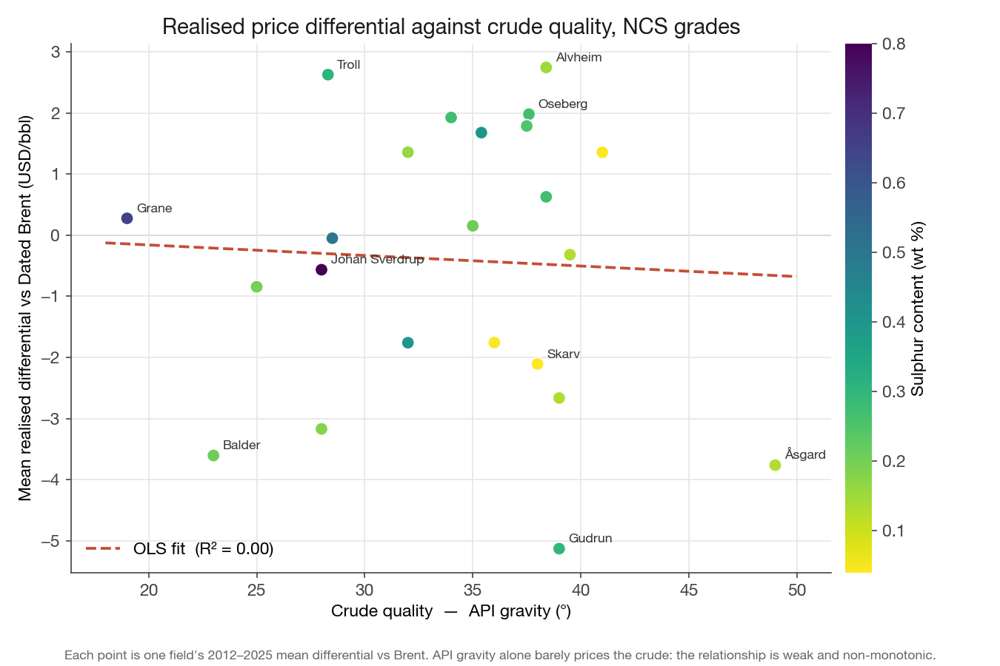

# NCS Crude Quality Model

A field-by-field quantitative model of the Norwegian Continental Shelf that estimates the realised crude price each field earns relative to Dated Brent, how fast each field's oil production declines from its fluid properties, and a pre-peak production lifecycle forecast for new fields. Built entirely from public data by Emma Strandenskaar, a finance student at BI Norwegian Business School.

[](https://emmastrandenskaar.github.io/ncs-crude-quality-model/)

Click the map above to open the live interactive version. It covers 100+ NCS fields, each with its decline curve, production history and forecast, crude quality and realised differential.

Live map: https://emmastrandenskaar.github.io/ncs-crude-quality-model/

## Key findings

**1. Decline rates vary 25-fold across the shelf.** Observed annual oil decline runs from about 1.0 percent per year at Ekofisk, a mature giant, to about 38 percent per year at Edvard Grieg, with a median near 9 percent. This spread is the core motivation for the decline model.

**2. Decline is partly predictable from fluid physics.** A model using viscosity and a field-specific production premium fits 48 fields with in-sample R-squared 0.74. Under honest nested leave-one-out cross-validation the R-squared is about 0.66, with mean absolute error about 2.8 percentage points on the annual decline rate. The nested cross-validation removes a circularity in the premium term that would otherwise inflate the score.

**3. Field-level price discrimination is the real contribution.** A production-share-weighted reconstruction of field differentials matches Aker BP's reported quarterly realised oil price with mean absolute error 1.56 USD/bbl and R-squared 0.989 across 24 quarters from 2020 Q1 to 2025 Q4. One quarter (2026 Q1) was excluded as an implausible reported value. The discrimination matters at the field level, for example Valhall at about +0.62 USD/bbl versus Skarv at about -4.21 USD/bbl under current market conditions.

**4. The model does not beat Brent on the single blended number, and that is stated plainly.** At the blended portfolio level a naive assumption that fields realise flat Brent tracks the reported figure slightly better still, with mean absolute error about 1.31 USD/bbl. Positive and negative field differentials net out across a diversified portfolio. The value of the model is field-level discrimination.

**5. Crude quality alone does not explain the differential.** Univariate API gravity explains essentially none of the cross-field variation, with R-squared about 0.00, and the relationship is non-monotonic. Medium light-sweet grades earn the largest premiums (Troll about +2.6, Alvheim about +2.7 USD/bbl mean) while ultra-light condensates trade at discounts (Asgard about -3.8, Gudrun about -5.1 USD/bbl mean). This is why the model conditions on region, sulphur and refining margins rather than quality alone. The grade-level panel reaches out-of-time R-squared about 0.41.

## Figures



Six NCS fields, real Sodir annual production normalised to peak, with an exponential decline fitted at each field's annual rate. The spread runs from Ekofisk at about 1 percent per year, nearly flat, to Edvard Grieg at about 38 percent per year, steep.



Each field's 2012 to 2025 mean realised differential versus Dated Brent plotted against API gravity, coloured by sulphur. The relationship is weak and non-monotonic, which is why the price model conditions on region, sulphur and refining margins rather than quality alone.

## Method

The project is three connected models.

### Model 1, realised price by field

Realised field price equals Dated Brent plus a field differential. A company's realised price is the production-share-weighted average of its field differentials added to Brent. The differentials are modelled from crude quality and market structure, namely API gravity, sulphur, region, crack spreads and refinery utilisation. Validation is done against Aker BP's reported quarterly realised oil price. The reconstruction reaches mean absolute error 1.56 USD/bbl and R-squared 0.989 across 24 quarters. The honest caveat is that this does not beat a flat-Brent assumption at the blended portfolio level, because field differentials net out across a diversified portfolio. The contribution is field-level discrimination, not the blended number.

### Model 2, production decline from fluid properties

A field's annual oil decline rate is partly predictable from the crude's fluid physics. Heavier and more viscous oil tends to decline more slowly. A field-specific production-premium term captures performance above or below the physics baseline. The fitted form (V5.1) follows.

```
D = 0.094 + 0.011 * ln(viscosity) - 0.061 * P12 + 0.040 * |P12|
```

Here D is the annual decline rate and P12 is a 12-month production premium, defined as the log deviation of actual production from the physics baseline. The fit covers 48 fields with in-sample R-squared 0.74 and a nested leave-one-out cross-validated R-squared about 0.66. Crude API gravity is sourced in tiers, from operator-direct assay through robust Sodir DST, single-well DST, and blend-inherited values, with provenance tracked per field.

### Model 3, pre-peak lifecycle forecast

For fields not yet at peak, the model forecasts the production ramp, plateau and peak rate, then hands off to the decline model. Validation is on a hold-out set of 13 fields. The peak rate is a rough sizing tool with mean absolute error about 35 percent. Ramp duration is predicted within about 9 months and plateau duration within about 7 months. P10, P50 and P90 ranges are produced by bootstrap. The peak is approximate, not precise, and is presented that way.

## Repository layout

```
src/1_data_ingestion       Pull and clean the public data sources
src/2_quality_price_model  Realised price and quality differential model (Model 1)
src/3_decline_lifecycle    Decline model and lifecycle forecast (Models 2 and 3)
src/4_fluid_and_map        Crude fluid library, quality imputation, map builder
src/5_supporting_research  Exploratory analyses
data/                      Processed model outputs
figures/                   Static figures
docs/                      Interactive map and methodology
requirements.txt           Pinned Python dependencies
```

## How to run

You need Python 3 and the packages pinned in `requirements.txt` (pandas, numpy, scikit-learn, statsmodels, matplotlib, folium).

Install the dependencies with pip.

```bash
pip install -r requirements.txt
```

Regenerate the figures with the figures script.

```bash
python figures/make_figures.py
```

The decline and price model scripts live under `src/` and read from `data/` and `src/3_decline_lifecycle/data/`.

## Data sources

All data is public. No proprietary or licensed data is included. There is no Argus, no Platts and no Bull Invest data anywhere in this repository.

- **Sodir (Norwegian Offshore Directorate) FactPages.** Monthly and yearly field production, wellbore drill-stem-test (DST) fluid data, reserves.
- **EIA fundamentals.** Refinery utilisation, crude and product stocks, crack spreads.
- **World Bank commodity prices**, including Dated Brent.
- **Public operator crude assays** from Equinor, Aker BP and others, plus public assay aggregators.

## Limitations

This is a student project. The aim is careful, honest analysis rather than a finished commercial product. In-sample fit, out-of-sample fit and cross-validated fit are reported separately throughout. Where a result is weak, such as the near-zero univariate API R-squared, or approximate, such as the 35 percent peak forecast error, that is stated directly rather than smoothed over.
